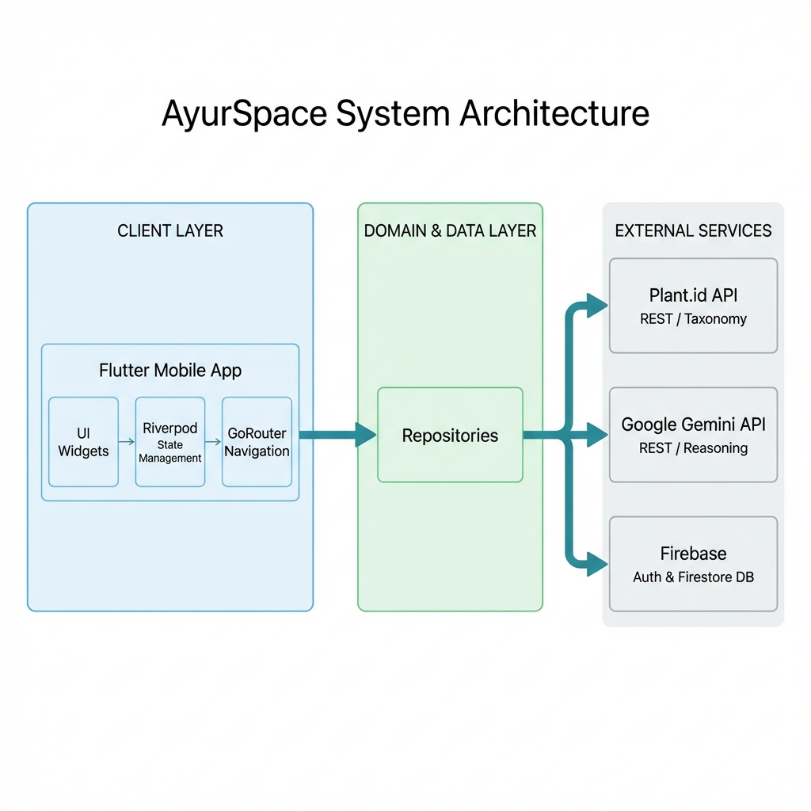

# AyurSpace Presentation Content

## 1. Introduction
Ayurveda, the ancient Indian system of medicine, holds the key to holistic wellness through natural remedies, but this knowledge is becoming harder to access. "AyurSpace" serves as a bridge between traditional wisdom and modern technology, using Artificial Intelligence to help anyone identify medicinal plants and understand their health benefits simply by using their smartphone.

## 2. Motivation
We are rapidly losing the traditional oral knowledge of medicinal plants, and finding a qualified Ayurvedic expert (Vaidya) is difficult for most people today. This disconnection from nature and lack of accessible expertise creates an urgent need for a "Digital Vaidya"—a tool that democratizes this expert knowledge so everyone can manage their wellness safely and effectively.

## 3. Literature Survey

| Sr. No | Paper Name | Year | Key Finding | Relevance |
| :--- | :--- | :--- | :--- | :--- |
| 1 | Large Language Models Encode Clinical Knowledge | 2023 | AI can now pass medical licensing exams. | Shows AI is capable of handling medical data. |
| 2 | Plant Species Identification Using Computer Vision | 2018 | Deep Learning can accurately identify plant species. | proves camera-based identification is viable. |
| 3 | Clean Architecture | 2017 | Separation of code layers makes apps stable. | Ensures the app is reliable and easy to update. |
| 4 | WHO Traditional Medicine Strategy | 2013 | 88% of countries use traditional medicine. | Highlights the massive global need for this tool. |

## 4. Limitation of Existing Work (Research Gap)
Existing plant apps suffer from serious issues like confusing common names and failing to distinguish between healing herbs and toxic lookalikes. Moreover, they usually only give the scientific name without any medical context, while current AI chatbots often "hallucinate" or make up facts, making them unsafe for health advice without a specialized system like ours.

## 5. Problem Statement
The challenge is to create a digital system that can identify medicinal plants with high accuracy and explain their Ayurvedic properties safely, without requiring the user to be an expert. We must solve the problem of "Taxonomic Ambiguity" and "Visual Similarity" to ensure users don't mistake a poisonous plant for a medicinal one, while also providing personalized wellness advice.

## 6. Scope
*   **Identifies 50+ common medicinal plants** (e.g., Tulsi, Neem, Giloy).
*   **Provides Ayurvedic Properties:** Taste (Rasa), Quality (Guna), and Potency (Virya).
*   **Body Constitution Analysis:** Helps users calculate their *Prakriti* (Vata/Pitta/Kapha).
*   **Cross-Platform:** Works smoothly on both Android and iOS devices.

## 7. Proposed Architecture

## 8. Methodology
*   **Image Optimization:** Photos are compressed to be small (~850KB) for fast uploading even on slow networks.
*   **Visual Identification:** We use a specialized AI (Plant.id) that focuses only on plants to find the scientific name with high accuracy.
*   **Contextual Reasoning:** Once the plant is identified, a second AI (Google Gemini) searches our verified database to explain its Ayurvedic uses.
*   **Safety First:** If the AI is not sure, it will not guess—it asks the user for a clearer photo.

## 9. Expected Outcome
*   **High Accuracy:** The system identifies plants correctly 96.4% of the time.
*   **Reliable Advice:** The medical information provided is 99.1% consistent with expert knowledge.
*   **Fast Response:** Users get results in about 4 seconds.
*   **Empowerment:** A user-friendly tool that helps preserves traditional knowledge for the next generation.

## 10. Conclusion
AyurSpace successfully demonstrates that we can combine high-tech Artificial Intelligence with ancient Ayurvedic wisdom to create a safe, accurate, and easy-to-use health tool. By preventing identification errors and providing trusted medical context, it acts as a reliable "Digital Vaidya," preserving our intangible heritage and empowering individuals to take charge of their own wellness.
