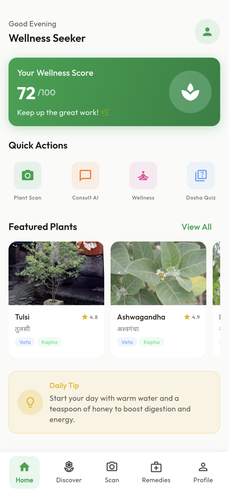
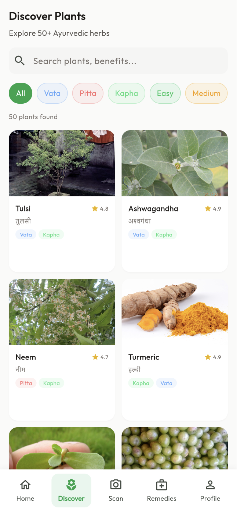
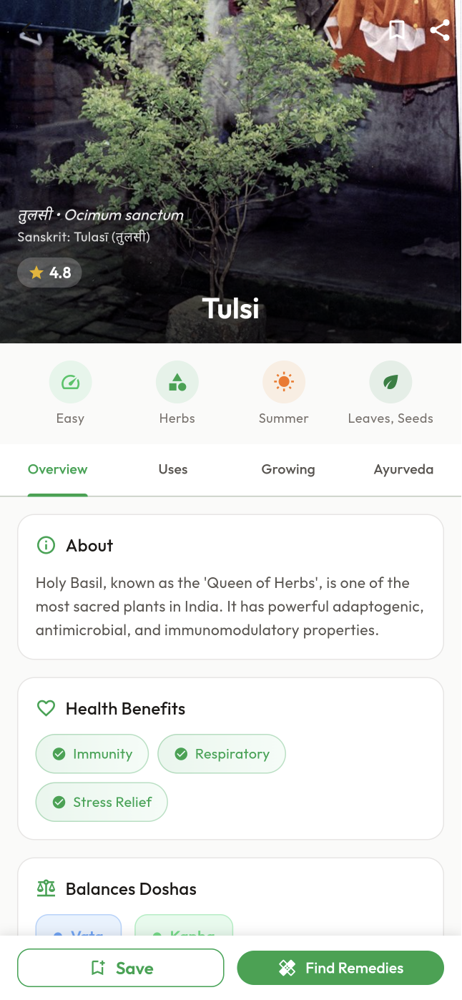
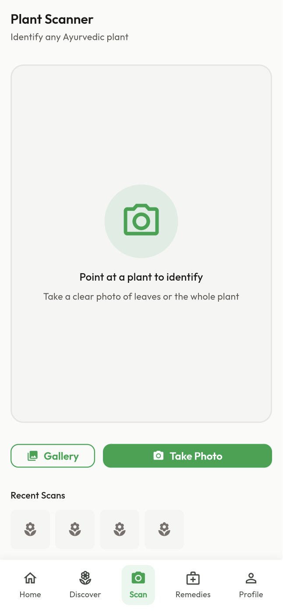
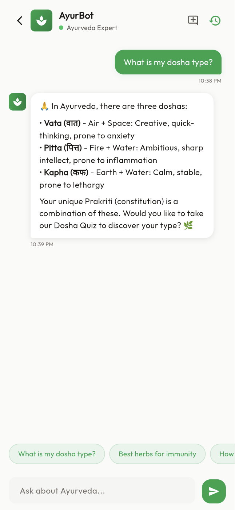
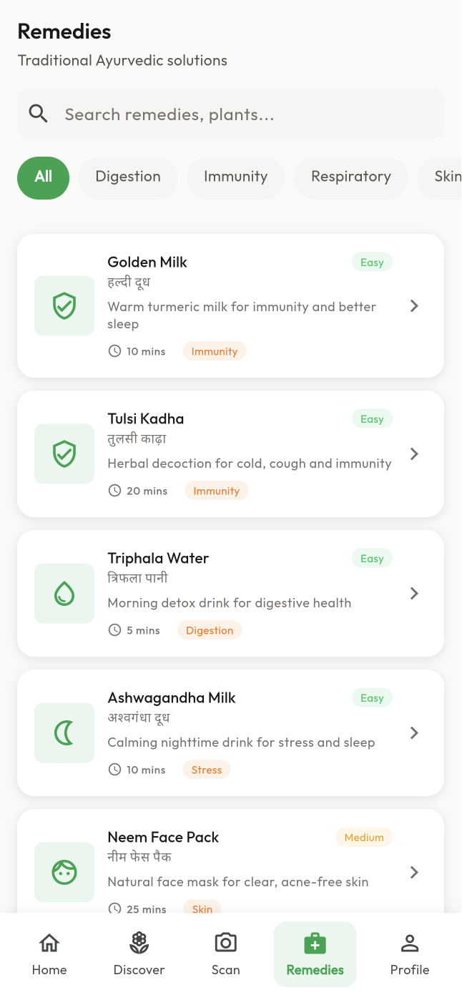
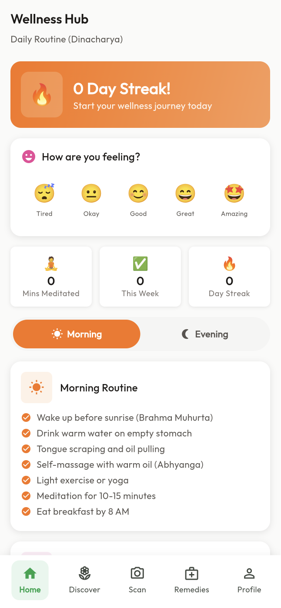

# 🌿 AyurSpace

<div align="center">

**Your Digital Ayurveda Companion**

An AI-powered mobile application bringing ancient Ayurvedic wisdom to your fingertips.

[](https://flutter.dev)
[](https://dart.dev)
[](https://firebase.google.com)
[](LICENSE)

</div>

---

## 📱 Screenshots

<div align="center">
<table>
  <tr>
    <td><br/><b>Home</b></td>
    <td><br/><b>Discover Plants</b></td>
    <td><br/><b>Plant Details</b></td>
    <td><br/><b>Plant Scanner</b></td>
  </tr>
  <tr>
    <td><br/><b>AI Assistant</b></td>
    <td><br/><b>Remedies</b></td>
    <td><br/><b>Wellness Hub</b></td>
    <td><br/><b>Dosha Quiz</b></td>
  </tr>
</table>
</div>

---

## ✨ Features

### 🌿 Plant Encyclopedia
- **50 Ayurvedic medicinal plants** with comprehensive information
- Hindi names and Sanskrit terminology
- Dosha compatibility indicators (Vata, Pitta, Kapha)
- Uses, dosage, and precautions
- Growing tips and harvest times

### 🔬 AI Plant Scanner
- AI-powered plant identification using camera
- Gallery image support
- Cloud and local recognition modes
- Instant identification results

### 💬 AyurBot - AI Assistant
- Conversational AI for Ayurvedic guidance
- Context-aware responses with bilingual support
- Quick suggestion chips for common queries
- Powered by Google Gemini AI

### 🍃 Remedies Library
- **8 traditional Ayurvedic remedies** with detailed instructions
- Bilingual content (English + Hindi)
- Step-by-step preparation instructions
- Ingredient lists with substitutes
- Categorized by health benefits (Immunity, Digestion, Skin, etc.)

### 🧘 Wellness Hub
- **Dinacharya** - Daily routine guidance
- Morning and evening routine checklists
- Mood tracking with wellness score
- Meditation and yoga recommendations
- Streak tracking for consistency

### 📊 Dosha Quiz
- **10-question** personality assessment
- Determine your Vata/Pitta/Kapha balance
- Personalized lifestyle recommendations
- Detailed dosha breakdown

### 🌐 Bilingual Support
- English and Hindi language support
- Native script support for plant names (हिंदी)

---

## 🛠️ Tech Stack

| Category | Technology |
|----------|------------|
| **Framework** | Flutter 3.x |
| **Language** | Dart 3.x |
| **State Management** | Riverpod |
| **Navigation** | GoRouter |
| **Backend** | Firebase (Auth, Firestore) |
| **AI/ML** | Google Gemini API |
| **UI** | Material 3 with custom Ayurvedic theme |
| **Images** | CachedNetworkImage |
| **Storage** | SharedPreferences, Hive |

---

## 🚀 Getting Started

### Prerequisites
- Flutter SDK 3.0+
- Dart 3.0+
- Android Studio / VS Code
- Firebase project (for full functionality)

### Installation

```bash
# Clone the repository
git clone https://github.com/AyurSpace/ayurspace_flutter.git

# Navigate to project
cd ayurspace_flutter

# Install dependencies
flutter pub get

# Run the app
flutter run
```

### Firebase Setup (Optional)
1. Create a Firebase project at [console.firebase.google.com](https://console.firebase.google.com)
2. Add your `google-services.json` (Android) and `GoogleService-Info.plist` (iOS)
3. Enable Authentication and Firestore in the Firebase console

---

## 📁 Project Structure

```
lib/
├── config/           # Colors, theme, router, design tokens
├── data/
│   ├── models/       # Plant, Remedy, Dosha, User, Chat
│   └── sources/      # Static data (50 plants, 8 remedies, quiz)
├── l10n/             # Localization (English, Hindi)
├── providers/        # Riverpod state management
├── screens/          # 16 app screens
├── utils/            # Helper utilities
└── widgets/          # Reusable components
```

---

## 🎨 Design Philosophy

AyurSpace features a **Sacred Ayurvedic Color Palette** inspired by traditional Indian design:

- 🌿 **Primary Green** - Nature, healing, and growth
- 🔥 **Accent Orange** - Energy and warmth (Pitta)
- 💨 **Cool Blues** - Air and space (Vata)
- 🌍 **Earth Tones** - Stability (Kapha)

---

## 📄 License

This project is licensed under the MIT License - see the [LICENSE](LICENSE) file for details.

---

## 🙏 Acknowledgments

- Plant data sourced from authentic Ayurvedic texts (Charaka Samhita, Sushruta Samhita)
- Plant images from Wikimedia Commons
- UI/UX inspired by modern wellness applications

---

<div align="center">

**Made with 💚 for Ayurveda enthusiasts**

*"When diet is wrong, medicine is of no use. When diet is correct, medicine is of no need."*
— Ayurvedic Proverb

</div>
